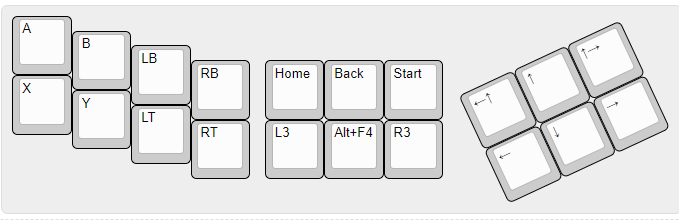

# MXBox 
MX Style Hitbox used primarily for fighting games using [QMK Firmware](https://docs.qmk.fm/)

Layout :
  

Parts List (What I'm currently using/purchased):
  20x [1N4148 Diodes](https://www.newark.com/on-semiconductor/1n4148tr/small-signal-diode-100v-200ma/dp/05R0353?CMP=AFC-OP)
  [30 AWG Electrical Wires](https://www.amazon.com/StrivedayTM-Flexible-Silicone-electronic-electrics/dp/B01KQ2JNLI/ref=sr_1_5?dchild=1&keywords=30+awg&qid=1610095320&sr=8-5)
(use whatever you have)
  20x [1U XDA White Blanks Keycaps](https://www.amazon.com/gp/product/B08DHDPHBF/ref=ewc_pr_img_2?smid=A1G2DAU9UMKTBG&psc=1)
  1x [Elite-C V4 - ATmega32u4](https://keeb.io/collections/frontpage/products/elite-c-low-profile-version-usb-c-pro-micro-replacement-atmega32u4)
  20x [Kalih Box Jades Mechanical Clicky Switches](https://kbdfans.com/products/novelkeys-x-kailh-box-thick-clicks-navy-jade)
(use whatever MX style mechanical switches you have)
  4x [M2 Standoffs & Screws](https://keeb.io/products/m2-screws-and-standoffs)
  1x Clear Acrylic Switch Plate part made at Ponoko.com
  1x Clear Arcylic Bottom Plate part made at Ponoko.com
  Other case parts are optional

Build Log:
  • Orders placed for all parts and currently waiting for shipping

Relevant Links/Resources:
  [QMK Documentation](https://docs.qmk.fm/)
  [How to Handwire a keyboard](https://www.youtube.com/watch?v=aFr8PEP5tlY)
  [Pro Micro](https://deskthority.net/wiki/Arduino_Pro_Micro)
  [MechMerlin's QMK Tutorial](https://www.youtube.com/watch?v=VR53Wo9Z960)
